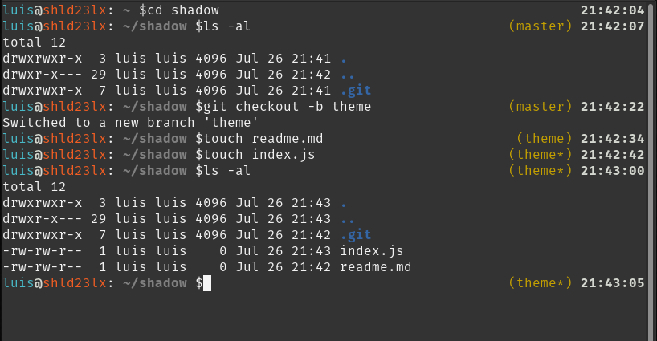

# shadow-zsh-theme
My theme for Oh-MyZsh created by reading other themes, adjusted to my likings.

---

## Left Side

- **Cyan** - User name
- **White** - Bold @
- **Orange** - Host name
- **Grey** - full directory
- **White** - semicolon
- **White** - CLi output

## Right Side

- **Yellow** - Git Branch with name indicator
- **White** - Time of line added in bold

---

### Screenshot

